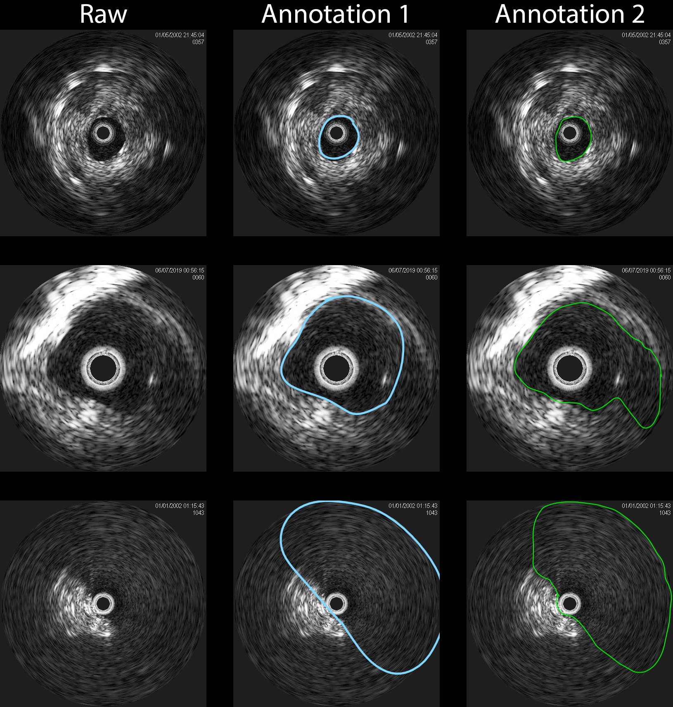

# U-Net-and-a-half: Convolutional network for biomedical image segmentation using multiple expert-driven annotations
This work is/will be published in EBioMedicine

## Introduction

This repo contains a PyTorch implementation of a deep learning framework that applies multiple experts' annotations in the learning stage and makes predciton with both accuracy and generalization. Our framework links a backboned encoder and 2 U-Net decoders where each decoder learns from a different annotation and updates paramaters back to the shared encoder. The schematic is shown below. 

 

The model was developed on two different datasets: whole scan images (WSIs) and intravascular ultrasound scans where each datasets involves 10 patients and during each model development, a 5-round cross-validation strategy was applied to ensure the reliablity. The description of each dataset is shown below.
 


The performance of the final global prediction from each UNaah model was compared against 2 experts' annotations and along with original U-Net models trained using each expert's annotation only. Example results are shown below.

Kidney WSI:<br/>

IVUS scan:<br/>


Please refer to our paper for more details. 

## How to use

### Code dependencies
we recommend using conda/anaconda to manage your environments. All essential packages have been listed in the environment file.
```
conda env create -f unaah_environment.yml
```
Please note that the dependencies may require Python 3.6 or greater. It is recommemded to install and maintain all packages by using [`conda`](https://www.anaconda.com/) or [`pip`](https://pypi.org/project/pip/). For the installation of GPU accelerated PyTorch, additional effort may be required. Please check the official websites of [PyTorch](https://pytorch.org/get-started/locally/) and [CUDA](https://developer.nvidia.com/cuda-downloads) for detailed instructions.

These instructions will help you properly configure and use the tool.

### Data
Please contact us for requiring raw data due to the size of data and privacy.

### Preprocessing
* **Making Binary or Multi-classes Masks**

    Clean bianry masks are critical in supervised learning. The pipeline of making binary masks is not restricted. If using our raw data, binary masks will be provided along with raw images and train, validation, test groups. If you prefer making your own binary masks, we also privide a jupyter notebook guidance on the main directory:
    
```
jupyter notebook
click 'create_binary_mask.ipynb'
```
where you can create and modify your own masking scripts. 
### YOU MAY NEED ADDITIONAL SCRIPTS TO GROUP YOUR TRAINING AND VALIDATION DATA.


* **Patching Whole-Slide-Images**
    
    For highly imbalanced datasets like tissue explants where you are looking for small things among irrelevants, it is recommanded that you patch the large image into smaller and easy-processed patches. Here we provide a solution: [`PyHist`](https://github.com/vkola-lab/unaah/tree/main/HistPreprocess). We have modified it to support patching raw images with their equal-sized annotations simultaneously.


### Train, validate and test UNaah models 

Taking the IVUS dataset as an example:
```
cd unaah
mv IVUS/* .
python IVUS_unaah.py (at this point a unaah model is ready, the following steps are for comparations and validations)
python IVUS_single_unet.py
python IVUS_making_plots.py
```
### You may need to move trainer files to the parent directory (the 'unaah' directory) and execute scripts.

Model weights and predicted raw scores on each subjects will be saved in:

```
./save/...
```

### You are free to modify and customize your own trainers based on your data type. Hyper-parameters used in IVUS trainers and WSI trainers fit their corresponding dataset only
